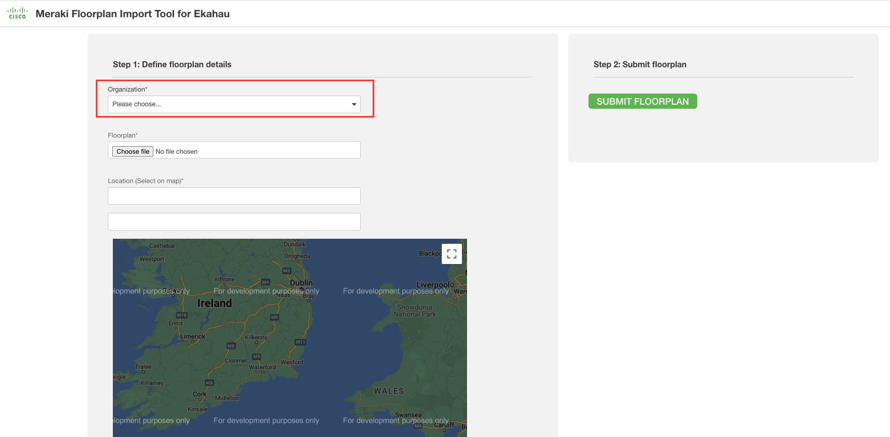
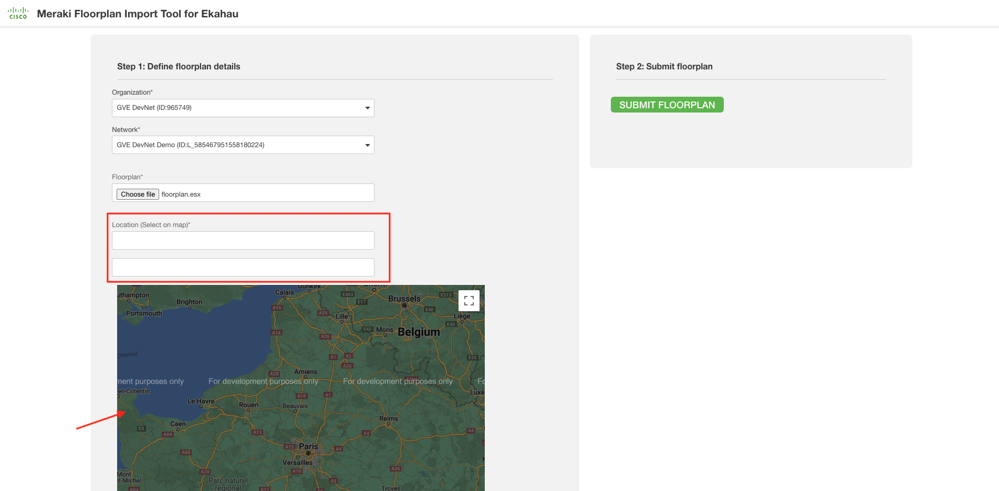
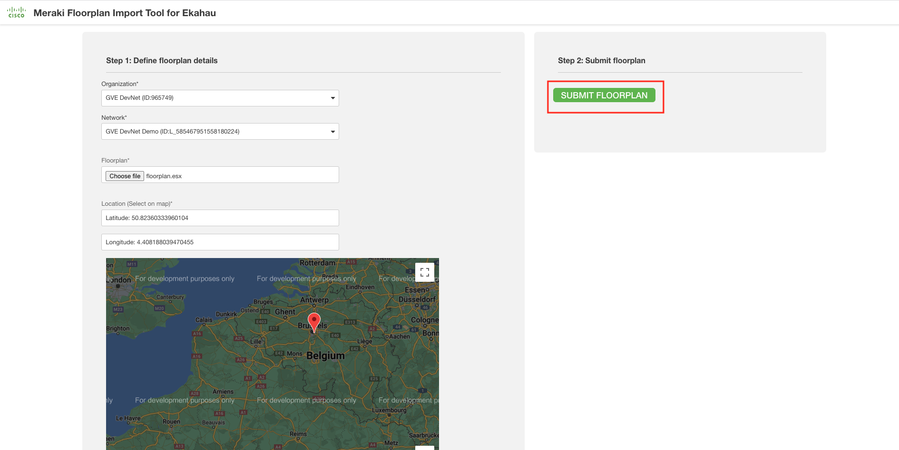

# GVE DevNet Meraki Floorplan Import from Ekahau
This prototype allows for uploading Ekahau heatmap to a Meraki dashboard as a network floorplan. Given a user's input of (1) a Meraki network, (2) an Ekahau heatmap and (3) the geographical coordinates of its location, the tool uploads the floorplan image to the Meraki cloud, as well as places the corresponding access points on it. 

## Prototype Overview


## Contacts
* Roaa Alkhalaf
* Stien Vanderhallen

## Solution Components
* Meraki REST API
* Meraki
* Ekahau

## Installation/Configuration

The following commands are executed in the terminal.

1. Set up a Python virtual environment. Make sure Python 3 is installed in your environment, and if not, you may download Python [here](https://www.python.org/downloads/). 
Once Python 3 is installed in your environment, you can activate the virtual environment with the instructions found [here](https://docs.python.org/3/tutorial/venv.html). 

2. Access the created virtual environment folder

        $ cd your_venv

3. Clone this repository

        $ git clone https://github.com/gve-sw/gve_devnet_meraki_floorplan_import

4. Access the folder `gve_devnet_meraki_floorplan_import`

        $ cd gve_devnet_meraki_floorplan_import

5. Install the dependencies:

        $ pip install -r requirements.txt

6. In `.env`, fill out your Meraki API key. Obtain this key in the Meraki dashboard, under `My Profile > API access`

```
MERAKI_API_KEY=<your-meraki-api-key>
```

## Usage
1. To launch the app, type the following command in your terminal:

        $ python3 app.py

2. To access the app, navigate in a browser to `localhost:5004`


# Workflow


1. On `localhost:5004`, you find the landing page of the prototype. Choose the targeted Meraki organization



2. Choose the targeted Meraki network 


3. Upload the Ekahau heatmap 


4. Select the geographical coordinates of the heatmap


5. Click on Submit Floorplan to submit the heatmap to Meraki cloud



# 


### LICENSE

Provided under Cisco Sample Code License, for details see [LICENSE](LICENSE.md)

### CODE_OF_CONDUCT

Our code of conduct is available [here](CODE_OF_CONDUCT.md)

### CONTRIBUTING

See our contributing guidelines [here](CONTRIBUTING.md)

#### DISCLAIMER:
<b>Please note:</b> This script is meant for demo purposes only. All tools/ scripts in this repo are released for use "AS IS" without any warranties of any kind, including, but not limited to their installation, use, or performance. Any use of these scripts and tools is at your own risk. There is no guarantee that they have been through thorough testing in a comparable environment and we are not responsible for any damage or data loss incurred with their use.
You are responsible for reviewing and testing any scripts you run thoroughly before use in any non-testing environment.
